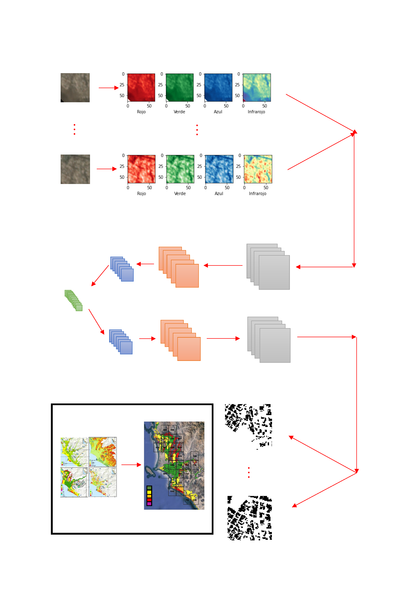

# Monitoring-urban-growth-in-high-risk-areas-with-AI

Sumérgete en la vanguardia del monitoreo urbano y descubre cómo la combinación de tecnologías avanzadas puede ayudar a abordar los desafíos de las zonas vulnerables.

Este repositorio está dedicado a difundir y mantener actualizados los scripts desarrollados en el proyecto de investigación de maestría titulado "Monitoreo del crecimiento urbano en zonas de alto riesgo empleando imágenes satelitales e inteligencia artificial.

**Contribuidor:** Ing. Javier Alonso Jaimes Cucho
**Asesor:** Luis Angel Moya Huallpa ([Página personal.](https://scholar.google.co.jp/citations?user=uJc3iy4AAAAJ&hl=en))

