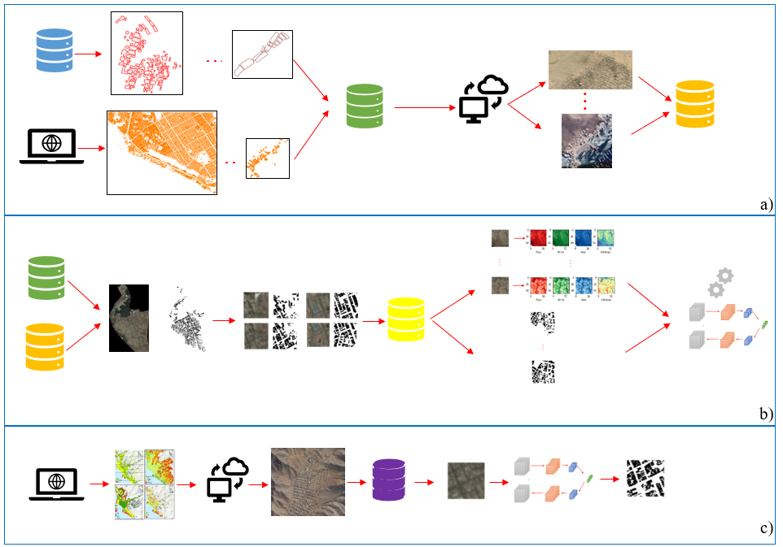

# Monitoring-urban-growth-in-high-hazard-areas-with-AI

Sumérgete en la vanguardia del monitoreo urbano y descubre cómo la combinación de tecnologías avanzadas puede ayudar a abordar los desafíos de las zonas vulnerables.

(a) Recolección de data de entrenamiento y descarga de imágenes de alta resolución. (b) Proceso de emparejamiento de imágenes de entrenamiento y máscara semántica, estandarización del tamaño de las imágenes de entrenamiento y entrenamiento de la red neuronal. (c) Localización de sitios de alto peligro de desastres, descarga de imágenes de alta resolución, estandarización y validación de la red neuronal calibrada.

Este repositorio está dedicado a difundir y mantener actualizados los scripts desarrollados en el proyecto de investigación de maestría titulado "Monitoreo del crecimiento urbano en zonas vulnerables empleando imágenes satelitales e inteligencia artificial.

**Contribuidor:** Ing. Javier Alonso Jaimes Cucho

**Asesor:** Dr. Luis Angel Moya Huallpa ([Página personal.](https://scholar.google.co.jp/citations?user=uJc3iy4AAAAJ&hl=en))

