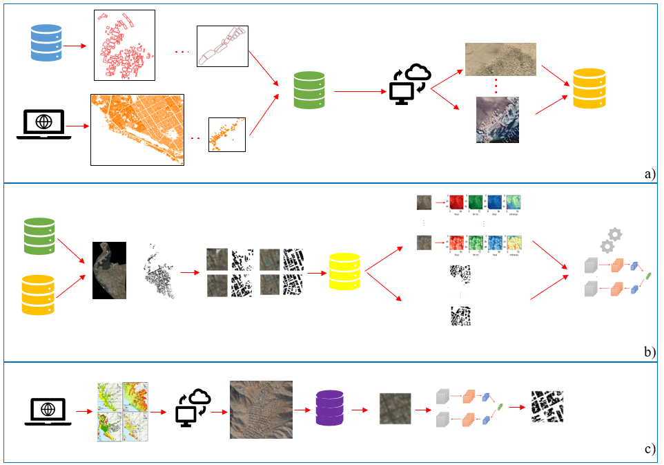

**(a)** Recolección de data de entrenamiento y descarga de imágenes de alta resolución. **(b)** Proceso de emparejamiento de imágenes de entrenamiento y máscara semántica, estandarización del tamaño de las imágenes de entrenamiento y entrenamiento de la red neuronal. **(c)** Localización de sitios de alto peligro de desastres, descarga de imágenes de alta resolución, estandarización y validación de la red neuronal calibrada.
